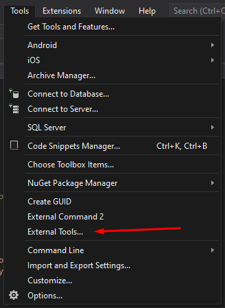
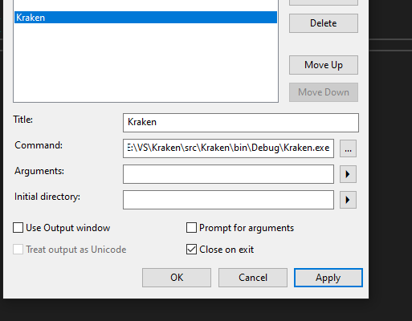

# Kraken
Тулза для получения конфигурации из октопуса
Скачиваем, редактируем параметры в App.config, 
добавляем нужные конфигурации артефактов в файл configurations.json.

Для удобной работы в VS добавляем внешнюю команду

За весь код спасибо Кириллу Костыряченко. Собственно вся работа с октопусом написана им, я лишь добавил виндовую формочку
